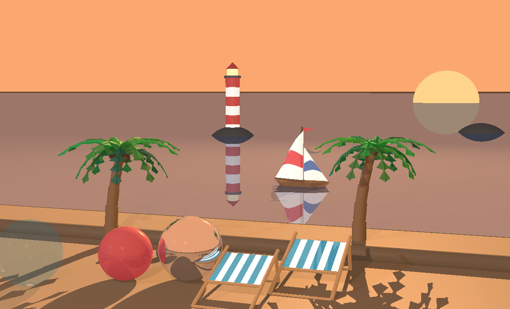
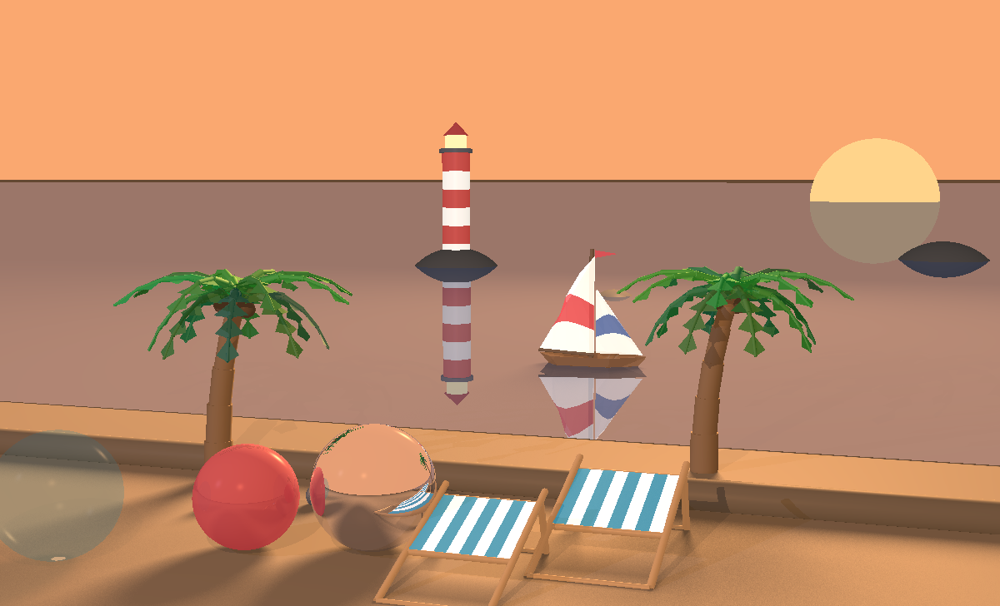

# ISE_5786_0504_4821

Java ray-tracing engine built for the software-engineering ray-tracing course:
3D geometry, a camera, a Phong lighting model, recursive reflection/refraction,
shadows, and rendering acceleration.

## Overview

This project implements:

1. **Primitives**: `Point`, `Vector`, `Ray`, `Double3`, `Util`, `Color`, `Material`, `AABB`, `Blackboard`
2. **Geometry API**: `Intersectable`, `Geometry`
3. **Geometry implementations**: `Plane`, `Sphere`, `Triangle`, `Polygon`, `Tube`, `Cylinder`, `RadialGeometry`
4. **Composite geometry**: `Geometries` (collection of intersectables with optional BVH acceleration)
5. **Lighting**: `Light`, `LightSource`, `AmbientLight`, `DirectionalLight`, `PointLight`, `SpotLight`
6. **Renderer**: `Camera` (with a nested `Builder`), `ImageWriter`, `RayTracerBase`, `SimpleRayTracer`, `RayTracerType`
7. **Scene model**: `Scene` with background color, ambient light, geometries, and light sources
8. **Scene loading**: XML/JSON parsing into `Scene` via `scene.io.SceneLoader`

Core capabilities currently include:

1. Vector and point algebra
2. Ray point evaluation (`Ray#getPoint(double)`)
3. Surface normals for supported geometries
4. Ray intersection calculations for the implemented geometries
5. Camera construction through a builder-based API
6. Ray generation through the camera view plane
7. Phong reflectance model (ambient, emission, diffuse, specular) per material
8. Multiple light sources: directional, point, and spotlight (including narrow-beam focus)
9. Shadows, including transparency-aware shadow rays through partially transparent bodies
10. Recursive global effects: reflection (`kR`) and refraction/transparency (`kT`)
11. Soft shadows via area light sources (light radius + multi-ray sampling)
12. Rendering acceleration: a Bounding Volume Hierarchy (BVH) over the scene geometries
13. Multithreaded rendering (parallel stream and thread-pool strategies)
14. External scene loading from XML/JSON files

## Project Structure

```text
src/
  geometries/
    api/          Intersectable, Geometry
    impl/         Plane, Sphere, Triangle, Polygon, Tube, Cylinder, RadialGeometry, Geometries
  lighting/       Light, LightSource, AmbientLight, DirectionalLight, PointLight, SpotLight
  primitives/     Point, Vector, Ray, Double3, Util, Color, Material, AABB, Blackboard
  renderer/       Camera, ImageWriter, RayTracerBase, SimpleRayTracer, RayTracerType
  scene/          Scene
    io/           SceneLoader, SceneParser, XmlSceneParser, JsonSceneParser, SceneParsingUtils
  test/           Main.java (runtime sanity checks)
unitTests/
  geometries/impl/
  primitives/
  renderer/
  scene/
  manual/         Final-picture scenes (BeachScene, BeachScene2, BeachBedScene, PalmTreeScene, MultithreadingTests)
lib/              Local JUnit jars used by the IntelliJ module setup
docs/             Design notes (e.g. soft-shadows-design.md)
images/           Rendered PNG outputs from the tests
```

- `src\` contains production code.
- `unitTests\` contains JUnit 5 tests plus the `manual\` rendered-scene drivers.
- `src\test\Main.java` contains basic runtime sanity checks.
- `lib\` contains local JUnit jars used by the IntelliJ module setup.
- `images\` holds the PNG outputs produced by the rendering tests.

## Prerequisites

1. Java JDK (project is configured as an IntelliJ Java module)
2. IntelliJ IDEA (recommended)

## Running the Project

### Run sanity checks

Run `src\test\Main.java` as a Java application.

Expected result: if no error lines are printed, sanity checks passed.

### Run unit tests

Run all tests under `unitTests\` with JUnit 5 from IntelliJ.

The module file `ISE_5786_0504_4821.iml` is configured with:

1. `src` as source root
2. `unitTests` as test source root
3. JUnit 5 jars from `lib\`

### Render scenes

The tests under `unitTests\renderer\` and `unitTests\manual\` render images and
write them to the `images\` folder via `ImageWriter`. Run a test (for example
`RenderTests`, `LightsTests`, `ShadowTests`, `TransparencyReflectionTests`,
`SoftShadowTests`, `BVHTests`, or one of the `manual\` scenes) to regenerate the
corresponding PNG.

## Rendering Features

### Lighting and materials

- `Material` carries the ambient (`kA`), diffuse (`kD`), specular (`kS`),
  transparency (`kT`), and reflection (`kR`) coefficients plus `nShininess`.
- The Phong model combines ambient, emission, diffuse, and specular terms.
- Light sources: `DirectionalLight`, `PointLight` (with distance attenuation),
  and `SpotLight` (with optional narrow-beam focus).

### Shadows and global effects

- `SimpleRayTracer` casts shadow rays and supports recursive reflection and
  refraction up to a bounded recursion depth.
- Shadow rays are transparency-aware: partially transparent blockers attenuate
  rather than fully occlude the light, and shadow rays are distance-limited so
  geometry beyond the light source is never tested.

### Soft shadows

- A light source can be given a positive radius (`setSize`) and a sample count
  (`setNumOfRays`) to act as an area light, producing soft shadow penumbrae.
- `Blackboard` provides the geometric sampling service (target-area sampling
  with configurable shape and pattern). See `docs\soft-shadows-design.md`.

### Acceleration and performance

- `Geometries.buildBVH()` reorganizes the scene into a Bounding Volume Hierarchy
  using `AABB` boxes; unbounded geometries (infinite planes and tubes) are kept
  outside the hierarchy.
- `Camera` supports three render strategies via `Builder.setRenderMode(...)`:
  `SINGLE` (baseline), `STREAM` (parallel stream over rows), and `THREADS`
  (thread pool pulling pixels from a shared counter), with a configurable thread
  count via `setThreadsCount(...)`.

## Before / After

### Soft shadows (visual quality)

Area lights replace the hard, sharp-edged shadows of a point-sized source with
soft penumbrae. Same beach scene (`BeachScene2`), shadows only:

| Before — hard shadows | After — soft shadows |
| --- | --- |
|  |  |

**The call that makes the difference.** In `BeachScene2` flipping one flag turns
the point-sized sun into an area light:

```java
// unitTests/manual/BeachScene2.java
private static final boolean SOFT_SHADOWS = true;   // false = hard shadows (left image)
...
if (SOFT_SHADOWS)
    BeachScene.addLights(scene, SUN_RADIUS, SUN_RAYS);   // sun.setSize(radius).setNumOfRays(rays)
```

**Where it lives.** A light with a positive radius is sampled across its disk in
`SimpleRayTracer.transparency(...)` — instead of one shadow ray, it averages many,
and partially-occluded samples are what produce the gradual penumbra:

```java
// src/renderer/SimpleRayTracer.java — transparency(intersection, light, l, n)
List<Point> samples = new Blackboard()
    .setSize(radius)                       // light disk radius (0 = hard shadow)
    .setNumOfRays(light.getNumOfRays())    // shadow-ray samples across the disk
    .orient(lightPosition, l)
    .points();
Double3 ktrSum = Double3.ZERO;
for (Point sample : samples) {
    Vector toSample = sample.subtract(shiftedHead);
    ktrSum = ktrSum.add(shadowRayTransparency(shiftedHead, toSample, toSample.length()));
}
return ktrSum.divide(samples.size());      // average over all samples → soft edge
```

The disk sampling itself is the geometry-only `primitives/Blackboard.java`; the
area-light radius and sample count live on `lighting/PointLight.java`
(`setSize` / `setNumOfRays`).

### BVH and multithreading (runtime)

The acceleration features render the **same** image — the win is wall-clock
time, not appearance. The beach scene (`BeachScene2`) is built from **834
geometries** (3 environment + 6 props + 72 sailboat + 21 background + 700 across
the two palm trees + 32 across the two loungers), so a ray that had to test every
one would be slow; the BVH lets each ray skip whole groups whose bounding box it
misses. Measured end to end:

| Configuration | Render time | Speedup |
| --- | --- | --- |
| No BVH, single-threaded (baseline) | 21.849 s | 1.0× |
| BVH, single-threaded | 3.591 s | 6.1× |
| No BVH, multithreaded | 3.051 s | 7.2× |
| BVH + multithreaded | 0.955 s | 22.9× |

BVH and multithreading are independent wins that compound: the BVH cuts the
intersection work per ray, while the thread pool spreads pixels across cores.
Soft shadows raise the ray count per pixel, so the BVH is also what keeps that
quality affordable.

**The call that makes the difference.** A single line, right before building the
camera, reorganizes the flat geometry list into the hierarchy:

```java
// unitTests/manual/BeachScene2.java
if (USE_BVH)
    scene.geometries.buildBVH();   // flip USE_BVH to false to time the brute-force render
```

**Where it lives.** `Geometries.buildBVH()` partitions the scene into a recursive
binary tree of bounding boxes (`src/geometries/impl/Geometries.java`). Unbounded
geometries (infinite planes/tubes) have no finite box, so they stay at the top
level and are always tested; everything else is split recursively:

```java
// src/geometries/impl/Geometries.java — build(items, depth, maxDepth)
int splitAxis = chooseSplitAxis(items);                                   // "smallest box" heuristic
items.sort(Comparator.comparingDouble(g -> g.getBoundingBox().centerCoord(splitAxis)));
int mid = items.size() / 2;
Intersectable left  = build(items.subList(0, mid), depth + 1, maxDepth);
Intersectable right = build(items.subList(mid, items.size()), depth + 1, maxDepth);
return new Geometries(left, right);                                       // internal node = two child boxes
```

At render time each ray first tests the node's `AABB` (`primitives/AABB.java`,
slab method); if it misses the box, the entire subtree — potentially hundreds of
the 834 geometries — is skipped, which is where the speedup comes from.

## Current Test Coverage Areas

1. `primitives`: `Point`, `Vector`, `Ray`
2. `geometries.impl`: `Plane`, `Sphere`, `Triangle`, `Polygon`, `Tube`, `Cylinder`, `Geometries`
3. `renderer`:
   - `Camera` builder validation, ray construction, and camera-geometry integration
   - `ImageWriter` grid output
   - Emission and ambient rendering (`RenderStage6Tests`, `RenderTests`)
   - Lighting: `LightsTests`, `DirectionalLightTests`, `PointLightTests`, `SpotLightTests`, `MultiLightsTests`, `LightsFromFilesTests`
   - Shadows: `ShadowTests`, `SoftShadowTests`
   - Global effects: `TransparencyReflectionTests`
   - Acceleration/performance: `BVHTests`, `MultithreadingTests`
4. `scene`: `SceneLoaderTests` (XML/JSON loading)
5. `manual`: final-picture scenes (`BeachScene`, `BeachScene2`, `BeachBedScene`, `PalmTreeScene`)

## Notes

1. This repository currently uses IntelliJ module configuration instead of Maven/Gradle.
2. API documentation (Javadoc) is present across the main code and can be extended as features are added.
3. The camera supports builder-based setup for location, orientation, view-plane dimensions, view-plane distance, resolution, ray construction per pixel, render mode, and thread count.
4. Scene loading entry points are `SceneLoader.loadFromXml(...)`, `SceneLoader.loadFromJson(...)`, and `SceneLoader.load(...)`.
5. Bonus work completed across stages is tracked in `ProjectBonuses.md`.

## Maintenance

This README is intended to stay up to date with the codebase.
When new geometry types, lighting features, renderer capabilities, folders, or
test flows are added, update the relevant sections above.
